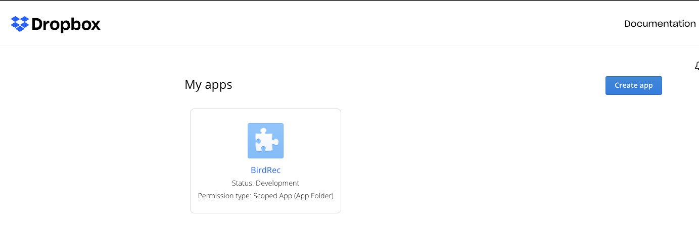
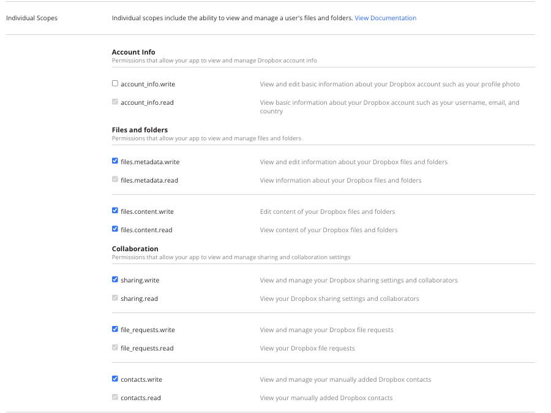
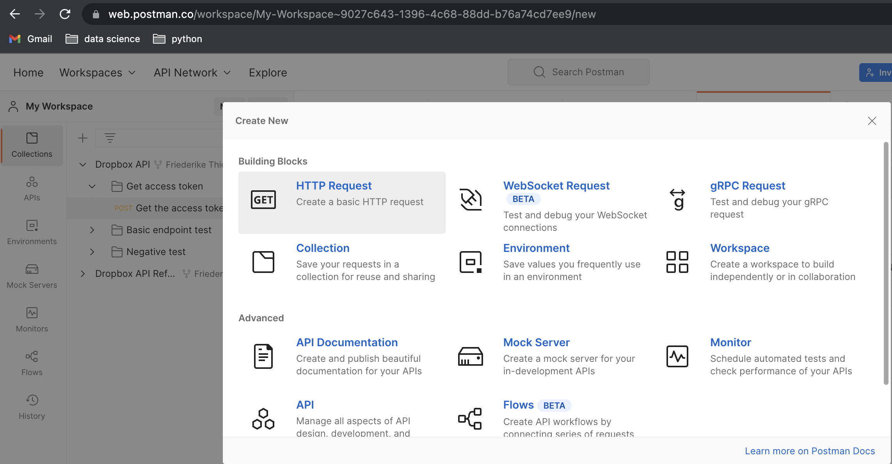
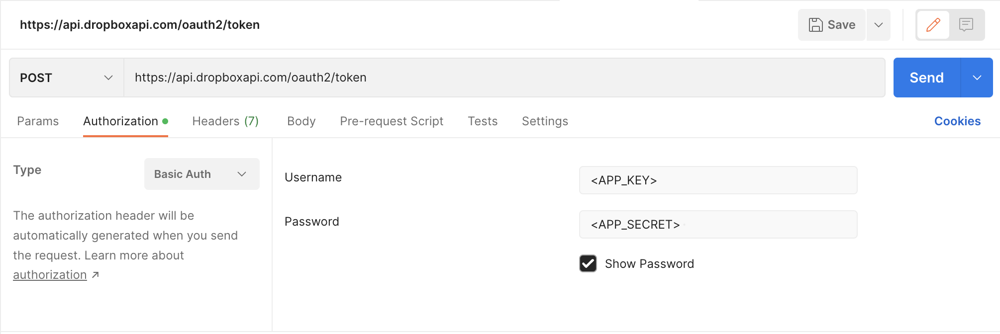
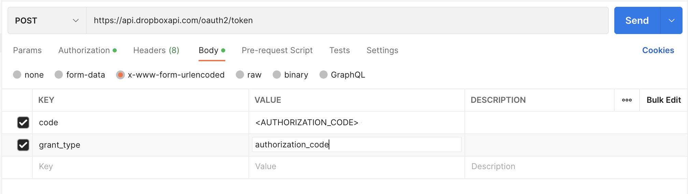

# Dropbox guide
You can store stuff on your local raspberry, but it does not have much storage & has no iftt integration. So Cloud it is. 
We checked Google Drive and Dropbox and although both are not very user friendly Dropbox is a bit easier.

## Get Dropbox Account
If you don't have one: get it. 

## Create App
- Go to: https://www.dropbox.com/developers/apps
- Hit create app 



## Setup App
- enable add. users
- go to permissions and just enable everything (trust me it works ONLY this way. Tested it for 8hrs +)



## Switch to raspberrypi
- The token is godforsaken long. No chance you type it without typos. 
- Therefore: open browser
- Open URL: https://www.dropbox.com/developers/apps
- Select the right app

## Create token

Dropbox has retired long-lived tokens on September 30th, 2021. There is a guide that offers help. The guide is very long and tiresome. There are two options for tokens that will be used in this guide. 

[More informaiton on the API changes in Dropbox API 2](https://dropbox.tech/developers/migrating-app-permissions-and-access-tokens)

### Fastest way for testing
- Hit the generate token button (The token is valid for about 2-4 hrs) 
- copy token 
- open your directory where the stuff is 
- open file 
- replace existing token example 

### Set up a refresh token
THIS IS SHIT! I mean seriously shit. Make sure to follow this step by step, otherwise you will not make it. I choose to use postman, because it is easiest. Courtesy to: 
- [Dropbox API documentation](https://dropbox.tech/developers/migrating-app-permissions-and-access-tokens)
- [Stack overflow](https://stackoverflow.com/questions/70641660/how-do-you-get-and-use-a-refresh-token-for-the-dropbox-api-python-3-x)

- Open URL: https://www.dropbox.com/developers/apps
- Copy  <APP_KEY>  
- Replace <APP_KEY> with your dropbox app key in the below Authorization URL
- https://www.dropbox.com/oauth2/authorize?client_id=<APP_KEY>&token_access_type=offline&response_type=code
- Complete the code flow on the Authorization URL. You will receive an AUTHORIZATION_CODE at the end.
- [Go to postman](https://web.postman.co/)
- I suggest you use the [Dropbox Workspace](https://www.postman.com/dropbox-api/workspace/dropbox-s-public-workspace/overview)
- Go to oauth section and check out the [token/from_oauth1](https://www.postman.com/dropbox-api/workspace/dropbox-s-public-workspace/request/576034-98a81267-590c-4798-8672-42a564a58134) part



- create a new POST request with below configuration



- Request URL- https://api.dropboxapi.com/oauth2/token
- Authorization 
    - Type = Basic Auth 
    - Username = <APP_KEY> 
    Password = <APP_SECRET> 



- Body
    - Select: "x-www-form-urlencoded"
- Key and values: 
    - code = <AUTHORIZATION_CODE> (obtained from step above) 
    - grant_type = authorization_code
- After you send the request, you will receive JSON payload containing refresh_token.
```
{
    "access_token": "sl.****************",
    "token_type": "bearer",
    "expires_in": 14400,
    "refresh_token": "*********************",
    "scope": <SCOPES>,
    "uid": "**********",
    "account_id": "***********************"
}
```
- I suggest you add your <APP_KEY> and  <APP_SECRET> to the json and upload it to your dropbox, so that you cann access this for copy and paste on the raspberry 

## Input values to file 
After you have created the token stuff you need to add this to the raspberry locally to ensure data integrity (and dropbox not killing your token).

When you have replaced it in the file:

## Go to terminal 
- initialise env 

```
source tflite1-env/bin/activate
```

- run model  
```
python3 TFLite_detection_webcam.py --modeldir=Sample_TFLite_model
```

## Please do not forgot to test. Dropbox is not nice. 
